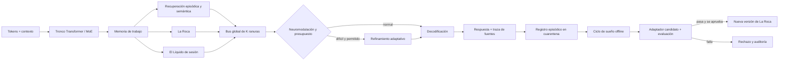

# Aethel NextGen: modelo operativo cognitivo verificable

**Autor:** Manus AI  
**Estado:** especificación de ingeniería; no es evidencia de consciencia, razonamiento humano ni aprendizaje autónomo.  
**Precondición:** el Dataset bilingüe permanece congelado localmente; no hay publicación en Kaggle, uso de GPU ni entrenamiento activo.

## Propósito y límite de la propuesta

La dirección correcta para Aethel no es declarar que un Transformer sea un cerebro humano, sino convertir la metáfora de **La Roca, El Líquido, el Sueño, la Neuromodulación y el Espacio de Trabajo Global** en contratos de cómputo que puedan medirse, fallar y corregirse. El núcleo actual ya contiene una implementación funcional de esos nombres, pero algunas partes son todavía mecanismos pequeños de laboratorio y no un sistema completo de aprendizaje continuo.

> **Principio rector:** durante una conversación o inferencia, Aethel puede recuperar, integrar y proponer; sólo una fase aislada, registrada y evaluada puede modificar parámetros adaptativos. La base estable nunca se reescribe de forma silenciosa.

## Auditoría del núcleo disponible

| Pilar | Estado implementado | Evidencia en el núcleo | Límite actual que debe mantenerse explícito |
|---|---|---|---|
| **La Roca** | Ruta lineal estable con ancla congelada. | `LaRoca` combina `stable_projection` con `anchor`, cuyo gradiente está desactivado. | La proyección sigue siendo entrenable; aún no existe un manifiesto de versión inmutable ni una política de promoción al conocimiento estable. |
| **El Líquido** | Traza hebbiana acotada y versionada; no muta pesos por observación. | `observe()` normaliza el estado, aplica decaimiento y escribe `liquid_versions.jsonl`. | La traza no es persistente en el `state_dict` y no hay caducidad, aislamiento por usuario ni revisión de efectos adversos. |
| **Ciclo de Sueño** | Buffer de replay con prioridad y diversidad aproximada. | `CicloDeSueno.consolidate()` conserva tokens y estados; `sample_pairs()` genera pares autoregresivos reales. | No hay job de consolidación, actualización de adaptadores, validación de regresión ni promoción automática; el buffer es volátil. |
| **Neuromodulación** | Señal de prioridad basada en sorpresa/pérdida. | `Neuromodulacion` emite prioridad limitada a `[0,1]`. | No está calibrada contra error predictivo ni recompensa externa; no debe interpretarse como motivación o voluntad. |
| **Espacio de Trabajo Global** | Fusión con compuerta de ruta sólida, líquida y memoria recuperada. | `EspacioTrabajoGlobal` registra pesos de las tres fuentes. | Aún no existe competición explícita entre especialistas, presupuesto de ancho de banda ni mecanismo de difusión a módulos separados. |
| **Memoria** | Memoria episódica, semántica y de trabajo con trazas de recuperación. | JSONL persistente para episódica/semántica, `GRUCell` para estado de sesión. | Los vectores se guardan sin política completa de procedencia, privacidad, caducidad, verificación factual o cifrado. |
| **Refinamiento adaptativo** | Pasos adicionales para estados seleccionados y telemetría de coste. | `RefinamientoAdaptativo` expone selección, fracción y pasos efectivos. | La puerta de dificultad inicia sin calibración; no debe prometer ahorro o mejor razonamiento hasta medirse en la GPU objetivo. |
| **Base lingüística** | Transformer con RoPE, GQA, Sparse MoE, KV-cache y adaptadores LoRA opcionales. | `AethelModel` es el tronco usado por `AethelNextGen`. | Sin un entrenamiento y evaluación reales sobre el Dataset congelado no hay capacidad lingüística nueva demostrada. |

La auditoría indica que el diseño de Aethel debe aprovechar la separación ya presente, no multiplicar módulos sin control. La diferencia decisiva será imponer **fronteras de mutación**, proveniencia y evaluaciones de promoción, no añadir un vocabulario neurobiológico a operaciones no verificadas.

## Base conceptual que sí es útil

La arquitectura propuesta toma ideas como hipótesis de ingeniería, no como equivalencia entre software y cerebro. Los modelos de sistemas de aprendizaje complementarios distinguen aprendizaje episódico rápido y representación semántica lenta; el replay durante una fase de consolidación puede favorecer la integración sin reescribir indiscriminadamente lo ya aprendido [1]. La literatura sobre espacio de trabajo global propone un canal compartido y limitado por el cual especialistas compiten para coordinar información; la limitación de capacidad es relevante, porque evita difundir todo a todos [2]. Asimismo, el cómputo adaptativo puede asignar pasos adicionales a entradas difíciles, pero su ventaja debe medirse y no asumirse [3].

## Arquitectura objetivo: cinco ritmos y tres estados de mutación

El diseño objetivo separa el sistema por **ritmo de operación** y por autoridad para cambiar estado. Esta es la condición que evita que una conversación aislada corrompa conocimiento estable.

| Ritmo | Componentes | Qué puede cambiar | Qué no puede cambiar |
|---|---|---|---|
| **Token** | Transformer, GQA/RoPE, MoE, KV-cache, router de cómputo. | Estado de activación y caché de contexto. | Pesos de La Roca, adaptadores, memoria durable. |
| **Sesión** | Memoria de trabajo, trazas líquidas efímeras, recuperación episódica. | Estado de sesión y propuestas de memoria con límites. | Checkpoint estable y corpus/holdout. |
| **Episodio** | Registro de observaciones, saliencia, deduplicación, cuarentena. | Cola de candidatos de replay. | Pesos, parámetros de seguridad y fuentes de evaluación. |
| **Sueño** | Curación, replay estratificado, entrenamiento LoRA aislado, evaluación. | Sólo un adaptador candidato y artefactos de prueba. | La Roca publicada hasta pasar todas las puertas. |
| **Promoción** | Revisión de regresión, procedencia y firma de versión. | Referencia de una versión estable aprobada. | Ninguna modificación sin artefacto evaluado y reversible. |

### 1. La Roca: conocimiento lento, versionado y recuperable

**La Roca** debe ser el checkpoint base, el tokenizador, el manifiesto de datos y los parámetros de seguridad que definen una versión. Mientras una versión está activa, su hash es inmutable. La adaptación de entrenamiento se realiza en una rama LoRA o en un candidato de consolidación; nunca directamente en los pesos de producción.

Una promoción requiere un `rock_manifest.json` con hash del checkpoint, hash del tokenizador, procedencia de datos, semilla, versión de código, evaluación de regresión y firma de aprobación. El sistema debe soportar retroceso atómico a la versión previa. En el código actual, esto exige sustituir la noción de `stable_projection` meramente entrenable por una referencia de checkpoint estable más un adaptador explícito y reversible.

### 2. El Líquido: aprendizaje rápido, acotado y sujeto a caducidad

**El Líquido** se divide en dos capas. La primera es una traza de activación de sesión que puede desaparecer al terminar el contexto y que sólo guía recuperación y enrutamiento; corresponde al mecanismo hebbiano actual. La segunda es un conjunto de adaptadores LoRA candidatos que puede aprender durante una consolidación aislada, pero que no se integra a La Roca sin superar pruebas.

Cada evento líquido debe llevar `event_id`, `content_hash`, `source_scope`, `salience`, `ttl`, `privacy_class`, `dedup_key`, `creation_version` y `promotion_state`. El decaimiento por sí solo no basta: una memoria debe expirar, ser revocada o quedar en cuarentena si no tiene procedencia o si causa regresión. La operación `observe` sólo puede **proponer**; no puede escribir pesos.

### 3. Ciclo de Sueño: consolidación offline, selectiva y reversible

El Ciclo de Sueño no debe ser una tarea misteriosa que “mejora por sí sola”. Es un proceso batch reproducible con cinco etapas: primero valida y desduplica episodios; después construye replay estratificado por idioma, dominio, recencia y saliencia; luego entrena un adaptador temporal; ejecuta evaluación de regresión; y, sólo si pasa, publica un candidato para revisión.

La separación episódico–semántica tiene una motivación técnica: el replay puede ayudar a integrar representaciones recién adquiridas sin usar todas las observaciones por igual [1]. No obstante, Aethel debe evaluar esa hipótesis con su propia pérdida en holdout, estabilidad del router, retención de tareas y contaminación de memoria; la analogía biológica no constituye una prueba.

### 4. Espacio de Trabajo Global: un bus escaso para hipótesis competidoras

El espacio de trabajo actual mezcla tres fuentes con una compuerta. La siguiente versión debe transformarlo en un **bus de K ranuras**, por ejemplo `K=4`, con propuestas de expertos MoE, memoria episódica, memoria semántica, La Roca y El Líquido. Cada propuesta incluirá una representación, una confianza calibrada, coste de cómputo, origen y evidencia recuperada. Un selector elige sólo las K propuestas que pasan umbrales de relevancia y seguridad.

La salida del bus se redistribuye al decodificador y a módulos de verificación, mientras que la traza externa muestra fuentes seleccionadas y operaciones realizadas, no una cadena de pensamiento privada. La idea de un canal de capacidad limitada y competición entre especialistas está alineada con los resultados de coordinación modular de Goyal y colaboradores [2], pero Aethel debe demostrar mediante ablación que el bus mejora coste o calidad frente a la fusión actual.

### 5. Neuromodulación: arbitraje de recursos, no deseo ni agencia

La neuromodulación se redefine como un conjunto de señales instrumentales: sorpresa calibrada, incertidumbre, novedad, conflicto entre memorias, riesgo de seguridad y coste estimado. Esas señales determinan si se recupera más evidencia, se abre una ranura de workspace, se ejecuta refinamiento adaptativo o se registra una experiencia para posible consolidación.

La señal debe permanecer auditada y limitada. No debe controlar objetivos de alto nivel por sí misma ni iniciar tareas externas. Las acciones de alto impacto permanecen detrás de políticas explícitas y confirmación humana.

## Ciclo operativo propuesto

El diagrama comunica flujo de datos y autoridad de mutación. No afirma que el sistema tenga experiencia subjetiva ni que su traza equivalga a razonamiento interno humano.

## Contratos de seguridad y validación

| Contrato | Regla comprobable | Evidencia esperada para aceptarlo |
|---|---|---|
| **Inmutabilidad activa** | Una sesión no modifica parámetros de La Roca. | Hash del checkpoint igual antes/después de conversación. |
| **Aislamiento de holdout** | `holdout` no entra en tokenización, replay ni ajuste. | Lista de hashes y auditoría del dataloader. |
| **Proveniencia de memoria** | Todo recuerdo durable tiene fuente, alcance y caducidad. | Esquema validado y JSONL firmado/hashable. |
| **Cuarentena líquida** | Ningún episodio actualiza pesos directamente. | Prueba que `observe()` no cambia `state_dict`. |
| **Promoción reversible** | Sólo se activa un candidato tras evaluación y se puede revertir. | Manifiesto de promoción y checkpoint previo disponible. |
| **No regresión** | El candidato no degrada el conjunto de regresión definido. | Métricas reales por idioma, dominio y router. |
| **Cómputo honesto** | Refinamiento y workspace justifican su coste. | Latencia, VRAM y calidad frente a una ablación base. |
| **Trazabilidad externa** | Se exponen fuentes y pasos de protocolo, no pensamiento privado. | Registro de recuperación, selección y evidencia. |

## Hoja de ruta experimental antes de entrenar

| Hito | Cambio limitado | Pregunta que responde | Criterio de avance |
|---|---|---|---|
| **M0** | Pruebas de invariantes del núcleo actual. | ¿Las rutas existentes funcionan sin mutar La Roca? | Tests de memoria, replay y hash de parámetros pasan. |
| **M1** | `rock_manifest` y adaptador candidato aislado. | ¿La adaptación es reversible? | Carga, rollback y comparación de hashes reproducibles. |
| **M2** | Runner de sueño offline con replay estratificado. | ¿El replay mejora retención sin fuga de holdout? | Auditoría de split y reporte real de retención. |
| **M3** | Workspace K-ranuras con trazas de origen. | ¿La competencia limitada supera la fusión de tres vías? | Ablación con igual presupuesto y resultados reproducibles. |
| **M4** | Neuromodulación calibrada y refinamiento bajo presupuesto. | ¿Asigna coste a casos difíciles de forma útil? | Curva calidad–latencia–memoria en hardware objetivo. |
| **M5** | Promoción con puertas y rollback. | ¿La consolidación evita regresión? | Regresión bilingüe y de dominios supera todas las puertas. |

La primera corrida de entrenamiento, cuando se autorice, debe usar esta especificación como lista de chequeo, no como garantía de inteligencia. El éxito inicial será modesto y verificable: un modelo pequeño que maneje español e inglés, produzca pérdidas y evaluación reales, conserve checkpoints y permita medir qué módulos mejoran o empeoran el resultado.

## Referencias

[1] [Liu, Ranganath y O'Reilly, *A complementary learning systems model of how sleep moderates retrieval practice effects*](https://pmc.ncbi.nlm.nih.gov/articles/PMC11543715/).

[2] [Goyal et al., *Coordination Among Neural Modules Through a Shared Global Workspace*](https://arxiv.org/abs/2103.01197).

[3] [Graves, *Adaptive Computation Time for Recurrent Neural Networks*](https://arxiv.org/abs/1603.08983).

[4] [Mashour et al., *Conscious Processing and the Global Neuronal Workspace Hypothesis*](https://pmc.ncbi.nlm.nih.gov/articles/PMC8770991/).
