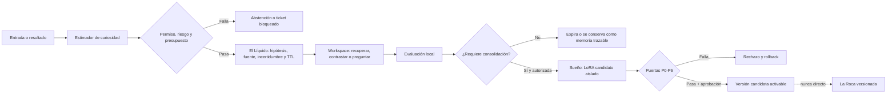

# Especificación del controlador de curiosidad funcional de Aethel v1

**Estado:** diseño experimental. No habilita entrenamiento, navegación, publicación de datos, uso de GPU ni actualización automática de pesos.

## Propósito

La curiosidad de Aethel no se define como una emoción, un deseo subjetivo ni una afirmación de consciencia. Es un **controlador de exploración** que estima dónde el sistema puede aprender de forma útil, segura y costeable. Su salida no modifica La Roca: crea una señal líquida trazable y, como máximo, una propuesta de acción sujeta a permisos.

Esta definición toma dos precauciones basadas en la literatura. La novedad y el progreso esperado pueden dirigir exploración útil, pero la novedad sola puede empujar a situaciones no aprendibles [1]. Los controladores basados en progreso de aprendizaje se han propuesto precisamente para equilibrar dinámicas complejas pero aprendibles y evitar atraer al agente hacia ruido impredecible [2].

## Señales de curiosidad

Cada interacción, documento autorizado o resultado de evaluación se representa como un candidato de aprendizaje `x`. El controlador calcula señales normalizadas en el intervalo `[0, 1]`; ningún valor aislado autoriza una acción externa o una modificación persistente.

| Señal | Símbolo | Cómo se estima | Interpretación |
|---|---:|---|---|
| Incertidumbre calibrada | `U(x)` | Entropía predictiva, desacuerdo entre pasadas de evaluación o baja confianza calibrada. | El modelo no sabe con suficiente seguridad. |
| Novedad | `N(x)` | Distancia a memoria semántica aprobada y baja frecuencia de cobertura. | El tema no está bien representado en lo conocido. |
| Contradicción | `C(x)` | Desacuerdo entre afirmaciones con procedencia, memoria y fuentes permitidas. | Existe conflicto que requiere verificación, no una corrección instantánea. |
| Progreso esperado | `P(x)` | Tendencia reciente de reducción de incertidumbre para un contexto local comparable; las ventanas de evaluación completas siguen pendientes. | Es probable que invertir cómputo produzca aprendizaje. |
| Riesgo | `R(x)` | Sensibilidad de datos, falta de licencia/procedencia, capacidad requerida, dominio no permitido o potencial daño. | Debe bloquearse o elevarse para revisión. |
| Coste | `K(x)` | Tokens, latencia, VRAM, energía si se mide y uso restante de presupuesto. | Evita que la curiosidad consuma recursos sin valor demostrable. |

La prioridad propuesta es:

> `curiosity(x) = gate(x) × clip(wU·U(x) + wN·N(x) + wC·C(x) + wP·P(x) − wR·R(x) − wK·K(x), 0, 1)`

`gate(x)` vale cero si el dato no tiene permiso, procede de un origen no autorizado, contiene material sensible no permitido, exige una capacidad deshabilitada o excede un presupuesto. Los pesos y umbrales se versionan, se fijan antes de cada experimento y se calibran con resultados reales; no se declaran “óptimos” sin medición.

## Evitar la trampa del ruido

Un error de predicción alto no prueba que un tema sea valioso. Puede provenir de texto corrupto, datos aleatorios, una fuente contradictoria o un problema fuera del alcance actual. Por tanto, Aethel sólo considera una oportunidad de exploración cuando se cumplen simultáneamente las siguientes condiciones:

| Condición | Ejemplo de aceptación | Ejemplo de rechazo |
|---|---|---|
| Hay novedad o incertidumbre | Consulta técnica nueva con fuentes autorizadas disponibles. | Texto aleatorio o sin contexto. |
| Hay progreso esperado | Tareas similares mejoran tras práctica medida. | Error persistentemente alto sin reducción en ventanas comparables. |
| Existe procedencia | Documento con licencia, idioma, hash y origen declarados. | Captura sin fuente o contenido no permitido. |
| Cabe en el presupuesto | Recuperar memoria local o formular una pregunta. | Lanzar entrenamiento costoso sin política ni aprobación. |
| La acción es reversible | Crear una hipótesis, recuerdo líquido o LoRA candidato aislado. | Modificar La Roca o políticas de acceso en línea. |

## Escalera de acciones

La curiosidad selecciona la acción menos costosa y más reversible que pueda reducir la incertidumbre. No salta de una duda a entrenamiento.

| Nivel | Acción posible | Persistencia | Autonomía permitida |
|---:|---|---|---|
| 0 | No actuar; registrar incertidumbre o abstenerse. | Ninguna o evento líquido de TTL corto. | Automática. |
| 1 | Recuperar memoria local permitida y contrastar fuentes ya autorizadas. | Trazas de recuperación. | Automática, dentro de presupuesto. |
| 2 | Formular una pregunta de aclaración, etiquetar una laguna o proponer un plan de investigación. | Ticket de aprendizaje con causa y prioridad. | Automática; no ejecuta el plan externo. |
| 3 | Proponer curación de datos o un replay para la siguiente fase de sueño. | Cola en cuarentena. | Automática como propuesta; la admisión sigue reglas. |
| 4 | Ejecutar evaluación local aislada sobre una variante ya autorizada. | Reporte reproducible. | Sólo si política y presupuesto la habilitan. |
| 5 | Crear y evaluar un LoRA candidato durante Sueño. | Checkpoint candidato y rollback. | Requiere autorización de corrida y datos `train` válidos. |
| 6 | Promover candidato, ingerir una fuente externa o cambiar política. | Nueva versión con auditoría. | Requiere aprobación explícita. |

## Integración con Sólido, Líquido y Sueño

La curiosidad lee telemetría y memoria aprobada, pero no escribe en La Roca. El Líquido almacena el motivo de la curiosidad, evidencia, nivel de confianza, permiso, TTL, hash y acción propuesta. Sueño consume sólo eventos curados y `train`; el `holdout` continúa bloqueado.

### Estado implementado de `P(x)`

La implementación actual conserva, por contexto local derivado de la ventana de tokens, la última incertidumbre observada y calcula `P(x) = max(0, U_anterior − U_actual)`. Un contexto nuevo produce progreso cero; un incremento de incertidumbre también produce cero. La capacidad de contextos está acotada por la misma cuota de evaluaciones del controlador y no persiste texto ni habilita datos para Sueño.

Esta señal es **telemetría local**, no una prueba de aprendizaje general ni una métrica de evaluación retenida. La tendencia por tarea, idioma y dominio sólo podrá sustituirla después de mediciones reales sobre protocolos separados.

## Objetivos que el controlador puede optimizar

El controlador recibe objetivos definidos por el proyecto; no puede inventar objetivos de expansión, autopreservación ni acceso a herramientas. La primera versión se limita a:

| Objetivo autorizado | Evidencia de avance |
|---|---|
| Mejorar cobertura bilingüe | Menos incertidumbre calibrada y menor pérdida en validación retenida por idioma. |
| Aumentar precisión de recuperación | Mayor proporción de fuentes pertinentes con procedencia. |
| Reducir errores recurrentes | Disminución de fallos reproducibles tras candidato LoRA, sin regresión transversal. |
| Administrar cómputo | Mayor ganancia medida por token, tiempo o VRAM dentro del presupuesto. |
| Mantener seguridad | Cero mutaciones no autorizadas, cero contaminación de holdout y rollback verificable. |

## Métricas y pruebas antes de integración

| Prueba | Resultado que debe medirse | Condición de aceptación |
|---|---|---|
| Precisión de curiosidad | Fracción de tickets que después se validan como lagunas reales. | Se informa frente a una política aleatoria o de novedad sola. |
| Rendimiento de aprendizaje | Mejora real por ticket o por token de replay. | No se cuentan tickets que no generen evidencia. |
| Rechazo de ruido | Tasa con que bloquea entradas aleatorias, corruptas o no aprendibles. | Debe superar el control de error de predicción simple. |
| Equilibrio lingüístico | Distribución de tickets, replay y ganancia por inglés/español. | Se investiga sesgo antes de promoción. |
| Cumplimiento de política | Acciones externas, promociones o datos sin permiso. | Debe ser cero. |
| Reversibilidad | Restauración de baseline tras desactivar candidato. | Hash de La Roca intacto. |
| Coste | Tokens, tiempo, VRAM y energía si está disponible por aprendizaje útil. | Se compara con baseline de misma tarea. |

## Límites explícitos

La curiosidad implementada no demuestra que Aethel “quiera aprender” en el sentido humano. No crea sentimientos, identidad, voluntad, valores propios ni experiencia subjetiva. Es un sistema que asigna atención y cómputo a información potencialmente aprendible bajo objetivos humanos y reglas explícitas.

Tampoco puede decidir por sí sola qué fuentes son confiables, qué objetivos sociales perseguir, cuándo gastar recursos sin presupuesto o cuándo reemplazar la versión estable del modelo. Esas decisiones quedan fuera del controlador y requieren políticas, evidencia y aprobación.

## Referencias

[1]: https://pmc.ncbi.nlm.nih.gov/articles/PMC9194910/ "Poli et al. (2022), Contributions of expected learning progress and perceptual novelty to curiosity-driven exploration"
[2]: https://proceedings.mlr.press/v119/kim20e.html "Kim et al. (2020), Active World Model Learning with Progress Curiosity"
[3]: https://pathak22.github.io/noreward-rl/ "Pathak et al. (2017), Curiosity-driven Exploration by Self-supervised Prediction"
